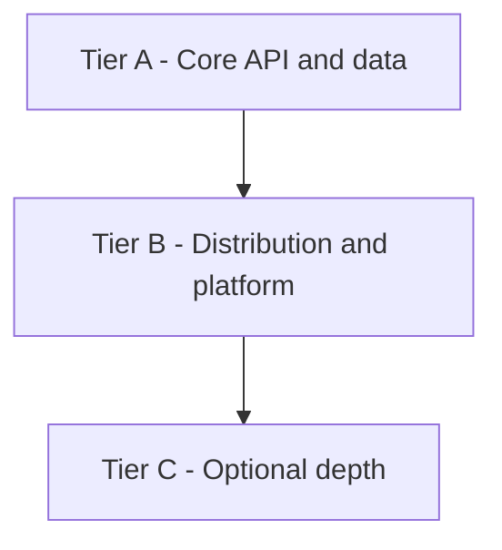

# GanHealth implementation tiers (roadmap)

This document is the **project-level** breakdown of delivery tiers for the GanHealth monorepo. It is **not** tied to a single chat or sprint: use it to prioritize work, onboard contributors, and align scope with the baseline in [`JD-PROJECT-BASELINE.md`](./JD-PROJECT-BASELINE.md).

**Infra assumptions** (DB on LAN / Docker host, env rules): [`INFRA-BASELINE.md`](./INFRA-BASELINE.md).

---

## How tiers relate to each other

- **Tier A** must be solid before investing heavily in **Tier B** (multiple services and shared infra multiply failure modes).
- **Tier C** is additive: pick one track when there is time or a specific interview/demo need.

---

## Tier A — Core backend and data (foundation)

**Goal:** One NestJS service (`user-service`) that is credible in interviews: validation, persistence, auth, API docs, and sane configuration.

**Typical deliverables**

| Area | Outcomes |
|------|----------|
| NestJS | Modular structure (controllers thin, services for domain logic), global concerns (filters, guards, throttling, request correlation where applicable). |
| Config | Validated environment (e.g. Zod + `ConfigModule`), no silent misconfiguration; graceful shutdown hooks for long-lived clients. |
| Prisma + MariaDB | Schema, migrations, indexes aligned with real queries; pagination for list endpoints; transactional boundaries where multiple writes must succeed or fail together. |
| Auth | JWT-based flow appropriate for the app (access/refresh pattern as implemented); secrets only via env. |
| API docs | OpenAPI/Swagger available; auth schemes documented. |
| Validation | Request validation at boundaries (project uses Zod + pipes; class-validator is an alternative pattern). |
| Tests | Unit tests for service logic and stable e2e smoke paths when CI requires them (may be phased in after the rest of Tier A). |

**Repo pointers**

- Application: `apps/user-service`
- Detailed Tier A checklist (user-service): [`TIER-A-USER-SERVICE-CHECKLIST.md`](./TIER-A-USER-SERVICE-CHECKLIST.md)

**Out of scope for Tier A**

- Second production microservice, API gateway, Redis, OIDC IdP integration (those are later tiers unless explicitly pulled forward).

---

## Tier B — Distribution and platform (differentiators)

**Goal:** Show you can reason about **boundaries**, **cross-cutting edge concerns**, and **operational dependencies** without turning the gateway into a second monolith.

**Typical deliverables**

| Area | Outcomes |
|------|----------|
| Service boundaries | Clear ownership of data per service; contracts between services (OpenAPI or shared types); no shared database across unrelated domains without governance. |
| HTTP between services | Timeouts, error mapping, and correlation IDs on outbound calls; idempotency and retries where appropriate (at least one path documented). |
| API gateway / BFF | Thin layer: routing, auth check at edge if that is the pattern, rate limiting, CORS; **business logic stays in domain services**. |
| Redis (pick one first) | Either **cache** (TTL + invalidation story) **or** **queue** for async work; avoid mixing both until one pattern is stable. |
| Observability (lightweight) | Structured logs; request ID propagation end-to-end where multiple hops exist. |

**Repo expectations**

- New Nx apps as needed (e.g. `api-gateway`, additional domain service), each with its own env and deploy story.
- Compose or deployment docs updated so LAN/Docker hostnames stay consistent with [`INFRA-BASELINE.md`](./INFRA-BASELINE.md).

---

## Tier C — Optional depth (choose deliberately)

**Goal:** One or two **focused** additions that support interview narratives without exploding scope.

**Examples (pick one or two, not all)**

| Track | Outcomes |
|-------|----------|
| GraphQL | Small Nest module: one query, one mutation; be able to discuss N+1 and query cost in regulated contexts. |
| Second Redis use case | Only after Tier B Redis pattern is stable (e.g. add queue if you started with cache, or vice versa, with clear justification). |
| Healthcare integration | Short design note or stub: FHIR resource mapping (e.g. Patient/Observation), PHI boundaries, audit considerations. |
| Angular surface | Thin but polished feature slice: lazy route, Material, typed API client, safe error handling (aligns with JD front-end bar). |
| Enterprise auth narrative | OIDC/OAuth2 + PKCE for SPA, JWT validation (issuer, audience, JWKS), RBAC — even if full Okta/Auth0 wiring is partial, document the target architecture. |

---

## Maintenance

- When a tier’s scope is **done** for a slice of the repo, update the relevant checklist or app README so the table of deliverables stays honest.
- When **infra** or **JD scope** changes, update this file if tier boundaries shift (e.g. auth moves from local JWT to IdP-only).

---

## Related documents

| Document | Role |
|----------|------|
| [`JD-PROJECT-BASELINE.md`](./JD-PROJECT-BASELINE.md) | Role, product capabilities, JD alignment table |
| [`INFRA-BASELINE.md`](./INFRA-BASELINE.md) | Docker/LAN, `DATABASE_URL`, service hostnames |
| [`TIER-A-USER-SERVICE-CHECKLIST.md`](./TIER-A-USER-SERVICE-CHECKLIST.md) | Actionable Tier A items for `user-service` |
